# machine-learning-project
## 1. Dataset:- IBM HR Analytics Employee Attrition & Performance
link for Dataset:- https://www.kaggle.com/datasets/pavansubhasht/ibm-hr-analytics-attrition-dataset

We need to uncover the factors that lead to employee attrition and explore important questions such as ‘show me a breakdown of distance from home by job role and attrition’ or ‘compare average monthly income by education and attrition’. This is a fictional data set created by IBM data scientists.

Education
1. 'Below College'  2. 'College'    3. 'Bachelor'       4. 'Master'     5. 'Doctor'

EnvironmentSatisfaction
1. 'Low'            2. 'Medium'     3. 'High'           4. 'Very High'

JobInvolvement
1. 'Low'            2. 'Medium'     3. 'High'           4. 'Very High'

JobSatisfaction
1. 'Low'            2. 'Medium'     3. 'High'           4. 'Very High'

PerformanceRating
1. 'Low'            2. 'Good'       3. 'Excellent'      4. 'Outstanding'

RelationshipSatisfaction
1. 'Low'            2. 'Medium'     3. 'High'           4. 'Very High'

WorkLifeBalance
1. 'Bad'            2. 'Good'       3. 'Better'         4. 'Best'

## 2. Data Visualization
#### 2.1. Checking Missing Values
There were no missing value present in Dataset
#### 2.2.	Check duplicates
There were no duplicate value were present
#### 2.3. Checking Imbalance in Dataset
There are less people who are leaving company compare who are staying.  People who are leaving company they were 16.1% and people who are no leaving they were 83.9%. This is a imbalance dataset.
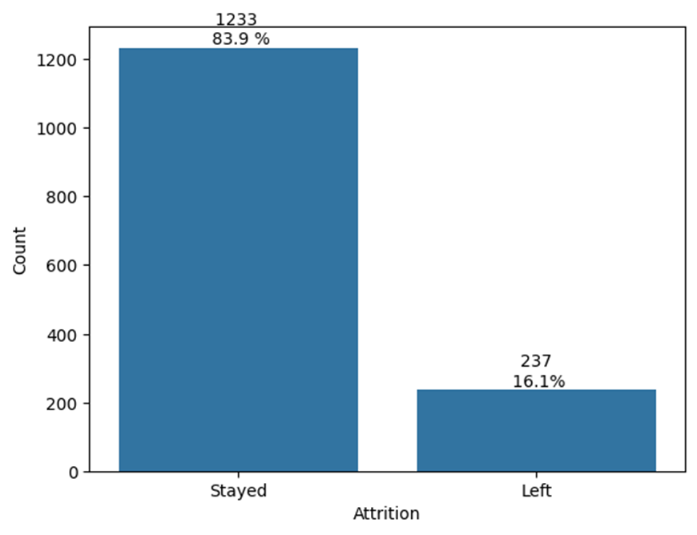

#### 2.4. Comparison between those who stayed and left
Comparing the mean and standard deviation of the employees who stayed and left
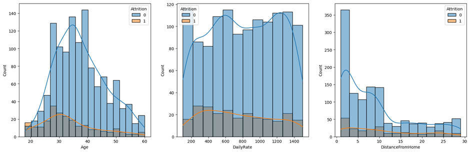
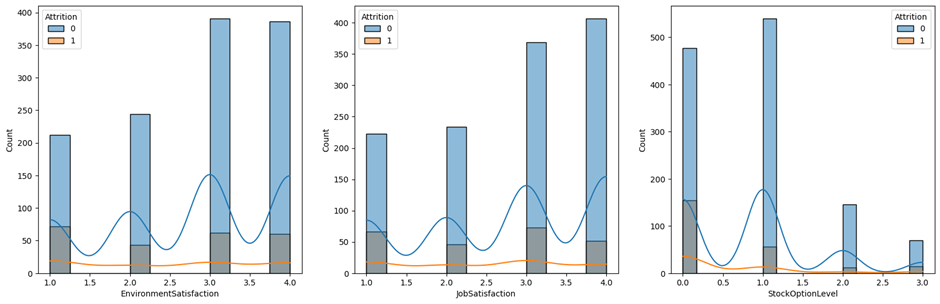
 
•	Age: Mean age of the employees who stayed is higher compared to who left
•	Daily Rate: Rate of employees who stayed is higher
•	Distance From Home: Employees who stayed live closer to home
•	Environment Satisfaction & Job Satisfaction: Employees who stayed are generally more satisfied with their jobs

#### 2.5. Corelation
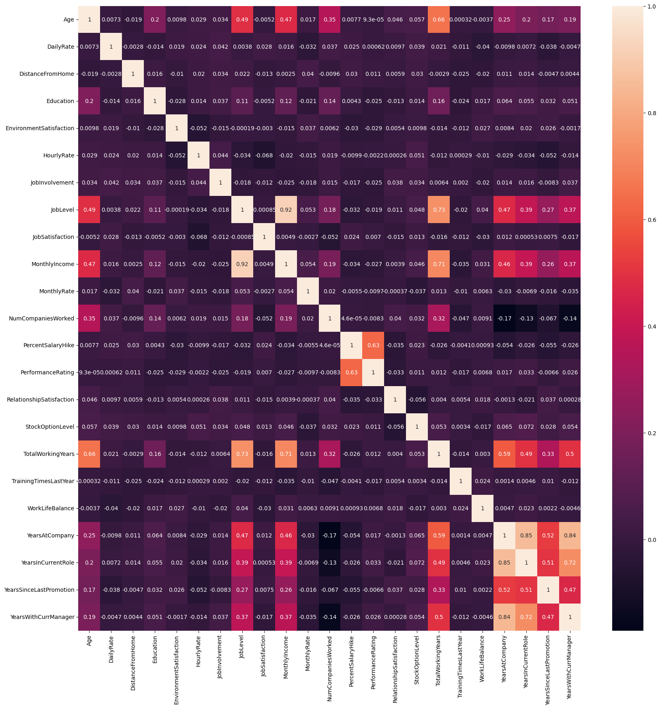
 
•	Job level is strongly correlated with total working year
•	Monthly income is strongly correlated with Job level
•	Monthly income is strongly correlated with total working year
•	Age is strongly correlated with monthly income
#### 2.6. Who tend to leave
•	Age:-> Younger people tend to leave more. Attrition rate is high from 18 to 26 age.
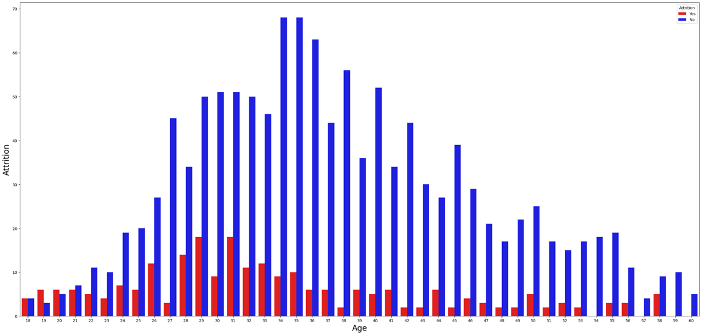 
•	Business Travel:-> Those who travel frequently they try to leave more.
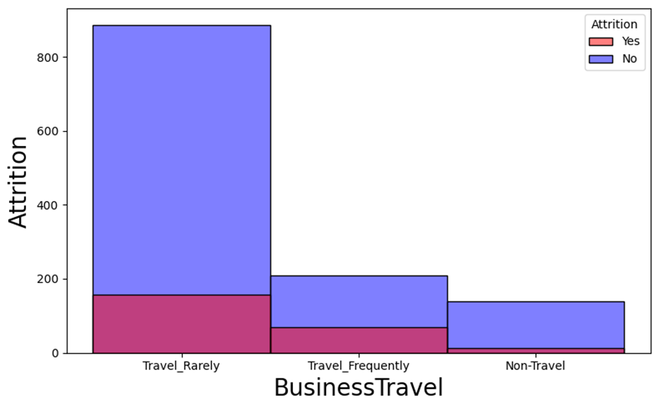 
•	Department:-> From Salse Department people try to leave more. 
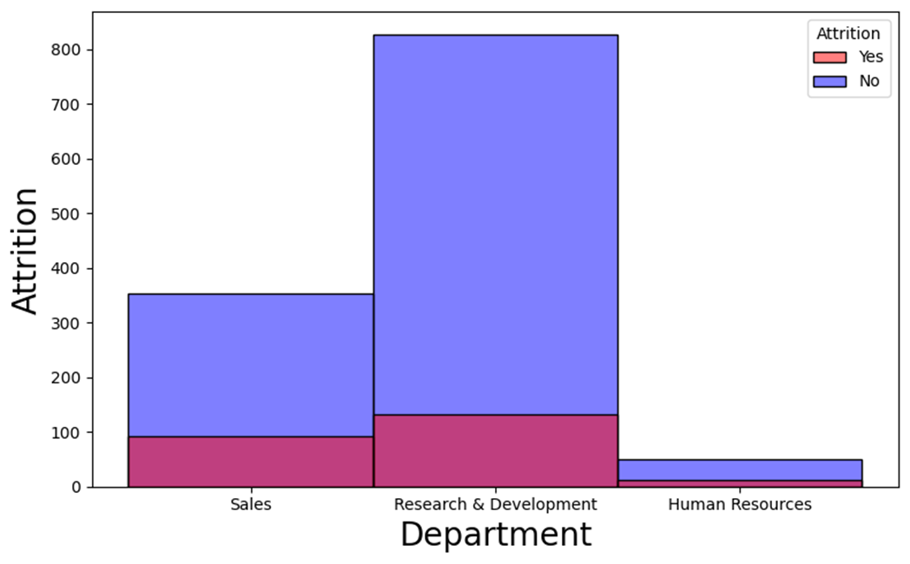
•	Education Field:-> Those who are in Marketing and Technical Degree they tend to leave more.
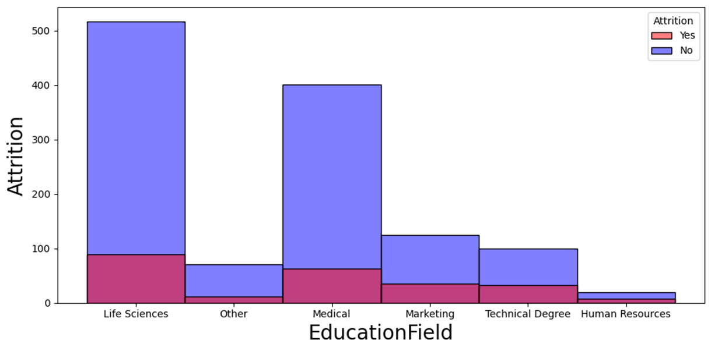 
•	Job Role:-> Sales Representative trying to leave more.
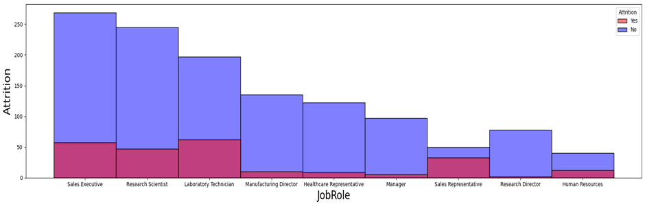  
•	Marital Status:-> Single employees tend to leave compared to married and divorced. 
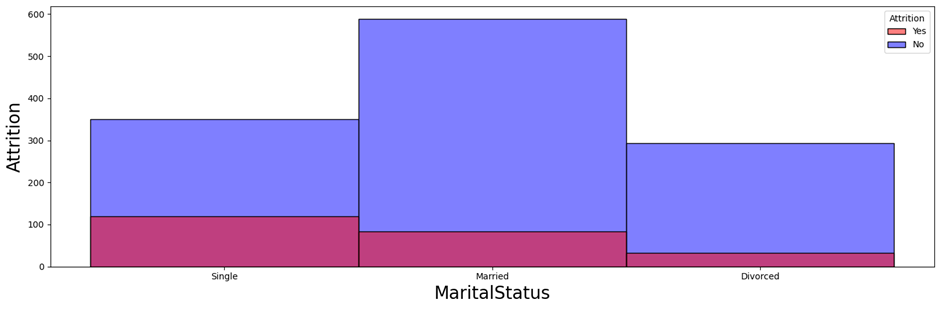 
•	Over Time:-> Those who doing Over Time(Yes) they tend to leave more.
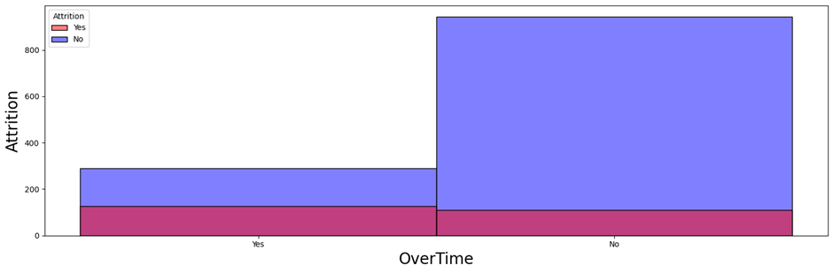  
•	Job Involvement:-> Less involved employees tend to leave the company.
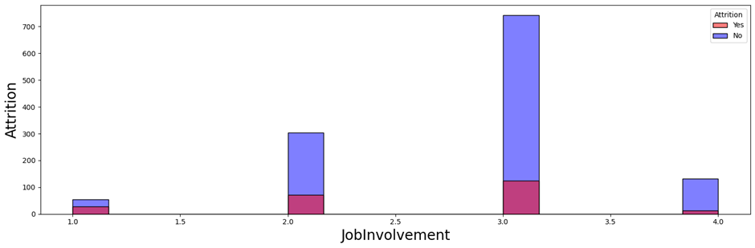  
•	Job Level:->Less experienced (low job level) tend to leave the company.
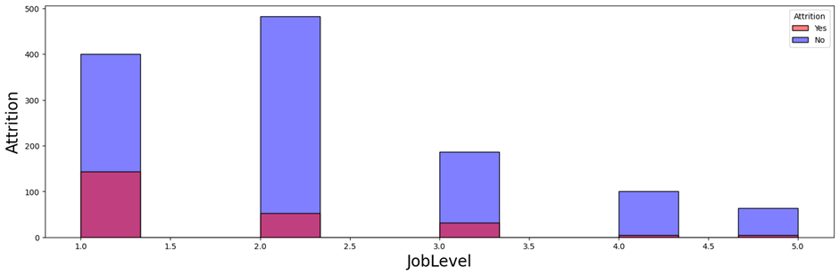  

#### 2.7. Other Significant things
•	There is significant difference in the distance from home between employees who left and stayed (p<.05)
•	Mann-Whitney's test to check if there is a significant difference between the two groups
•	p-value is 0.0023870470273627984 which is less than 0.05, so we reject the null hypothesis
•	There is significant difference in the distance from home between employees who left and stayed
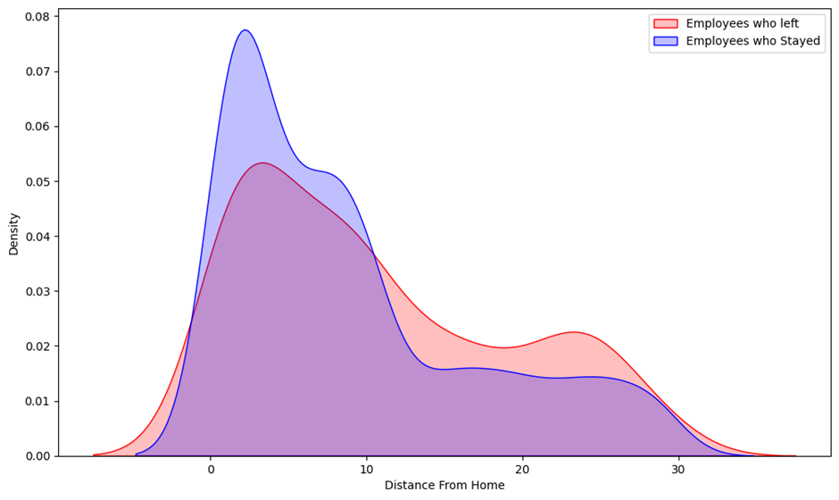  
•	There is significant difference in the Years With Current Manager between employees who left and stayed (p<.05)
•	p-value is 1.8067542583144407e-11 which is less than 0.05, so we reject the null hypothesis
•	There is significant difference in the years with current manager between employees who left and stayed
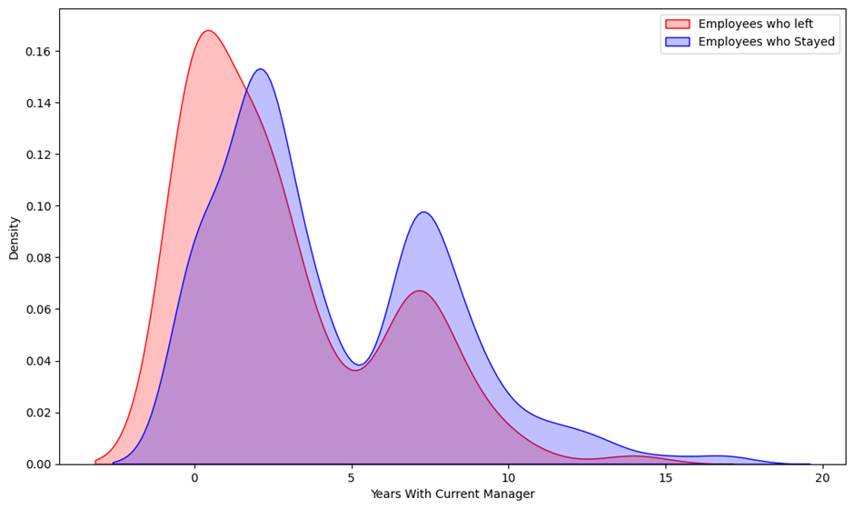  
•	There is significant difference in the Total Working Years between employees who left and stayed (p<.05)
•	p-value is 2.399569364798952e-14 which is less than 0.05, so we reject the null hypothesis
•	There is significant difference in the total working years between employees who left and stayed 
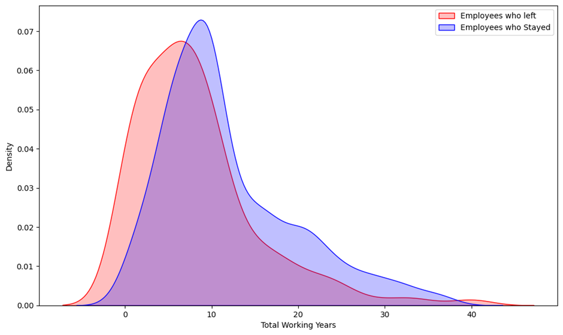 
•	There are no significant differences in Monthly Income between Female and Male employees (p=0.09)
•	p-value is 0.08841668326602112 which is greater than 0.05, so we fail to reject the null hypothesis and assume no differences in Monthly Income between Male and Female employees 
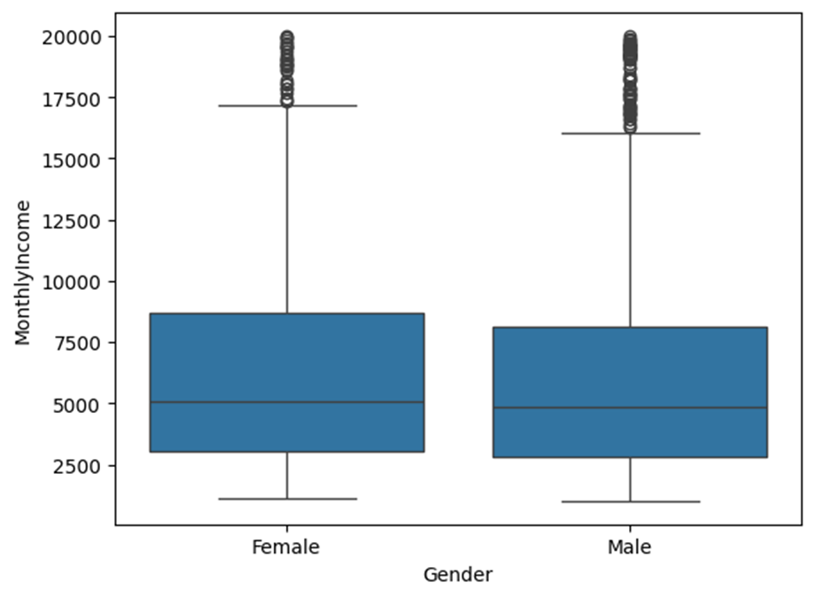 
•	Research Directors and Managers have the highest Monthly Income
•	Sales Representatives have the lowest Monthly Income, followed by Research Scientists and Lab Technicians  
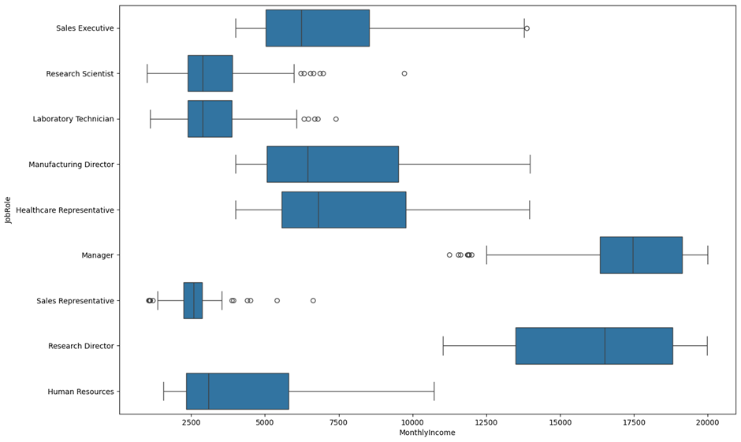

## 3.	Data Preparation
#### 3.1.	Dropping Columns
•	'EmployeeCount', 'StandardHours', 'Over18',and  'EmployeeNumber' column are drop first because there value is same for all employees except 'EmployeeNumber' but it’s is not so relevant.
#### 3.2.	Drop Higley Corelated Column
•	Here i will drop Some feature who highly corelated with others
•	'MonthlyIncome','YearsWithCurrManager','YearsInCurrentRole', and 'TotalWorkingYears',
#### 3.3.	One Hot Encoding
•	One hot Encoding is done in categorical which are 'BusinessTravel', 'Department', 'EducationField', 'Gender', 'JobRole',and 'MaritalStatus'.
•	Then concatenated with numerical columns.
#### 3.4.	Data Scaling
•	Min Max Scaler is used in scaling process.
#### 3.5.	Train and Test datasets
•	Data is divided into train test using function ‘train_test_split()’, test size is used 25% for this dataset.
#### 3.6.	Class Balancing
•	SMOTE is used in class balancing.
•	Then new train test dataset is created which is copy of old train test but this data is converted in tensor so that it can use later for Simple Nural Network.

## 4.	Model Selection and Training
•	'Logistic Regression', 'SVC', 'Random Forest Classifier', 'Decision Tree Classifier', 'XGB Classifier', 'CatBoost Classifier', 'K Neighbors Classifier' ,'Gaussian NB' ,'Gradient Boosting Classifier' ,'AdaBoost Classifier' ,and 'Simple Nural Network Binary Classification model' models are taken in selecting process for selecting the best model for this dataset.
•	'Simple Nural Network Binary Classification model' is made with the help of PyTorch library.
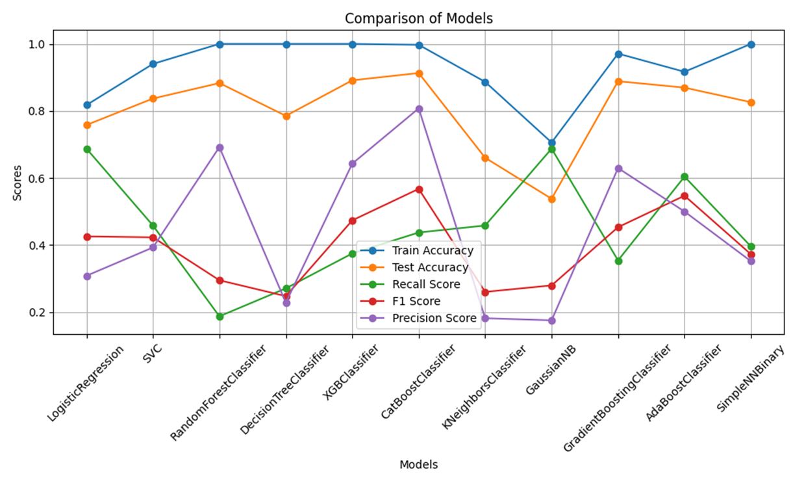

## 5.	Hyperparameter Tuning
•	With the help of Grid Search these parameters are finded for Logistic Regression
•	'C': 10
•	'class_weight': None
•	'fit_intercept': False
•	'multi_class': 'auto'
•	'max_iter': 100
•	'penalty': 'l2'
•	'solver': 'newton-cg'
•	'tol': 0.0001
•	'warm_start': True

## 6.	Conclusion:
LR showed a much better recall for the minority class (0.69). Even with the SMOTE balancing, models showed a low True Positive Rate for the minority class. This is most likely due to imbalanced classes and lack of data to train the model, but because it depends on the number of company's employees, we will have to stick with LR model as it showed the best results of all. On the other hand, in this case we give more importance to the correct prediction of employee attrition and we do not care much about false positives (employees predicted as leaving the company but actually stay).

## Steps to Run File

1. Make envioment thorugh 
`python -m venv file_path/env`
it will create vertual enviorment.
2. Then activate enviorment with 
`file_path/env/Scripts/activate`
3. To install dependeces use 
`pip install -r requirements.txt`
Wait for 2 or 3 minuts until all dependences downloded.
4. Then after if you want see data and it's insite use 
`python data_visualiation.py`
5. If you want see how model work use:
`python model.py`
6. If you want to see final model use
`python fila.model`