# Predicting Employee Attrition

## 1. Dataset: IBM HR Analytics Employee Attrition & Performance
[Link to Dataset](https://www.kaggle.com/datasets/pavansubhasht/ibm-hr-analytics-attrition-dataset)

We need to uncover the factors that lead to employee attrition and explore important questions such as "show me a breakdown of distance from home by job role and attrition" or "compare average monthly income by education and attrition". This is a fictional dataset created by IBM data scientists.

### Education
1. 'Below College' 
2. 'College'
3. 'Bachelor'
4. 'Master'
5. 'Doctor'

### Environment Satisfaction
1. 'Low'
2. 'Medium'
3. 'High'
4. 'Very High'

### Job Involvement
1. 'Low'
2. 'Medium'
3. 'High'
4. 'Very High'

### Job Satisfaction
1. 'Low'
2. 'Medium'
3. 'High'
4. 'Very High'

### Performance Rating
1. 'Low'
2. 'Good'
3. 'Excellent'
4. 'Outstanding'

### Relationship Satisfaction
1. 'Low'
2. 'Medium'
3. 'High'
4. 'Very High'

### Work-Life Balance
1. 'Bad'
2. 'Good'
3. 'Better'
4. 'Best'

## 2. Data Visualization

### 2.1. Checking Missing Values
There were no missing values present in the Dataset.

### 2.2. Checking Duplicates
There were no duplicate values present.

### 2.3. Checking Imbalance in Dataset
There are fewer people leaving the company compared to those staying. People leaving the company accounted for 16.1%, while those staying were 83.9%. This indicates an imbalance in the dataset.
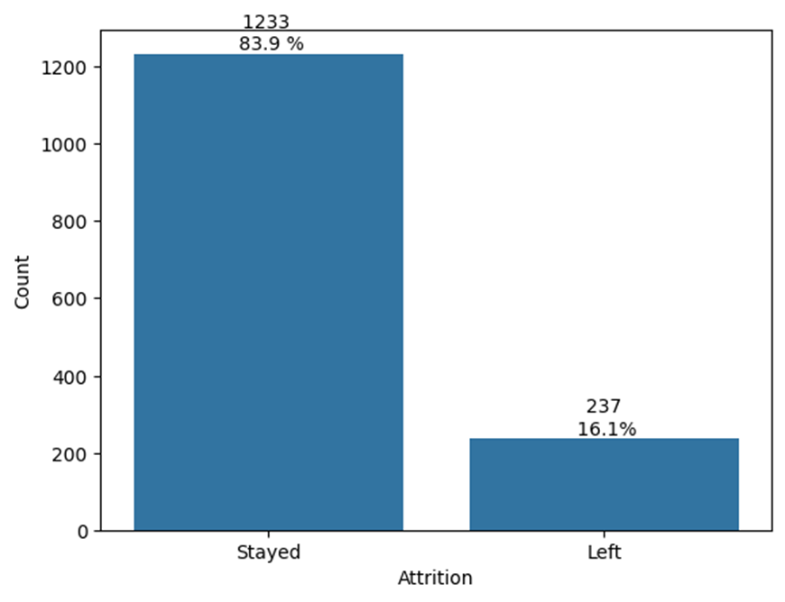

### 2.4. Comparison between Those Who Stayed and Left
Comparing the mean and standard deviation of the employees who stayed and left:
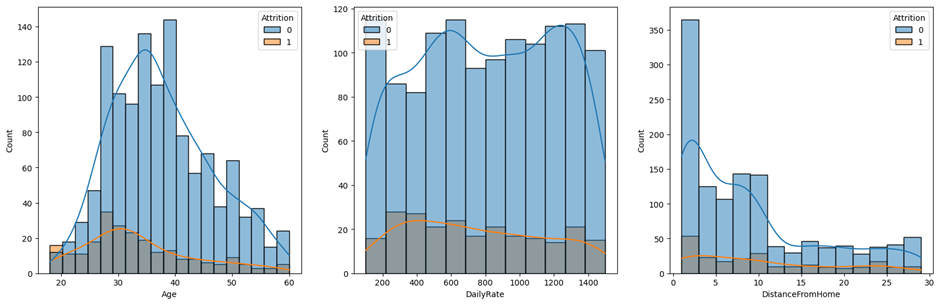
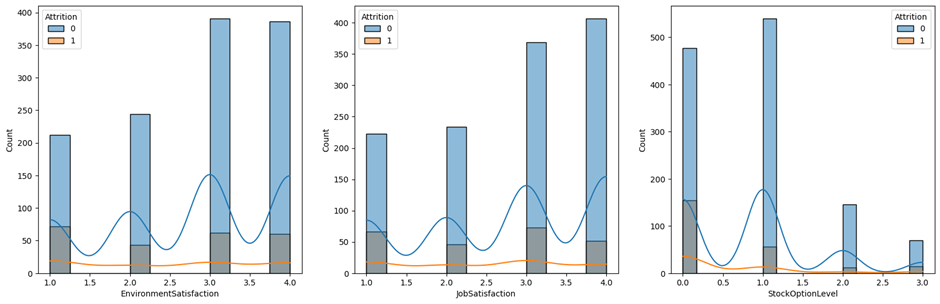

- Age: The mean age of the employees who stayed is higher compared to those who left.
- Daily Rate: The rate of employees who stayed is higher.
- Distance From Home: Employees who stayed live closer to home.
- Environment Satisfaction & Job Satisfaction: Employees who stayed are generally more satisfied with their jobs.

### 2.5. Correlation
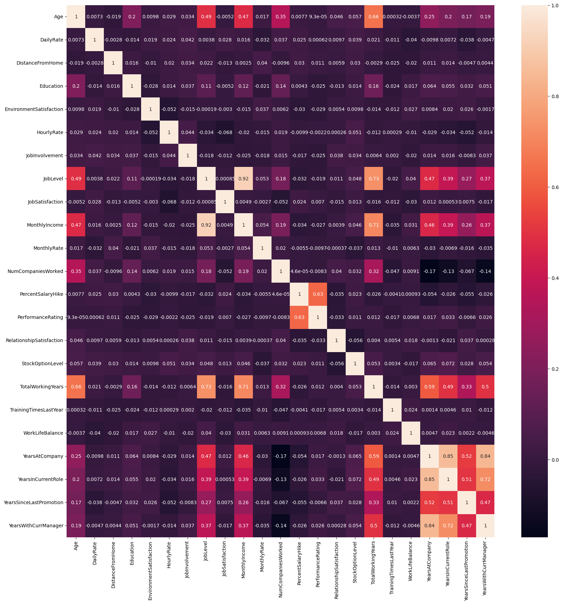

- Job level is strongly correlated with total working years.
- Monthly income is strongly correlated with job level.
- Monthly income is strongly correlated with total working years.
- Age is strongly correlated with monthly income.

### 2.6. Who Tend to Leave
- Age: Younger people tend to leave more. The attrition rate is high from 18 to 26 years.
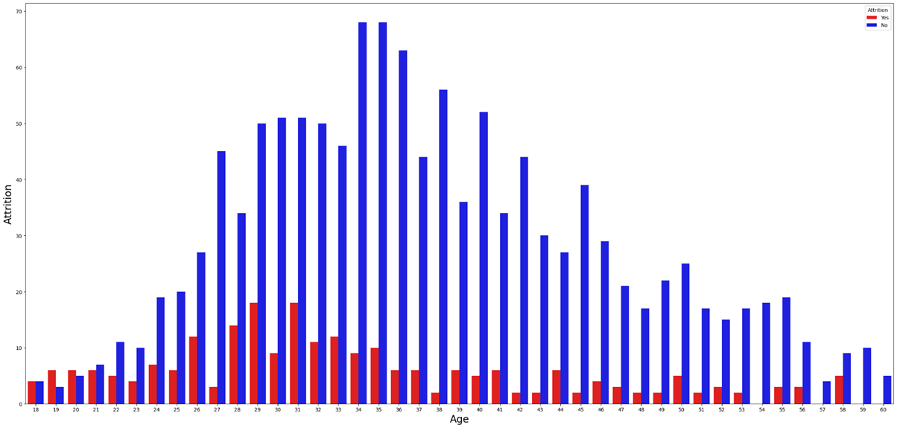
- Business Travel: Those who travel frequently tend to leave more.
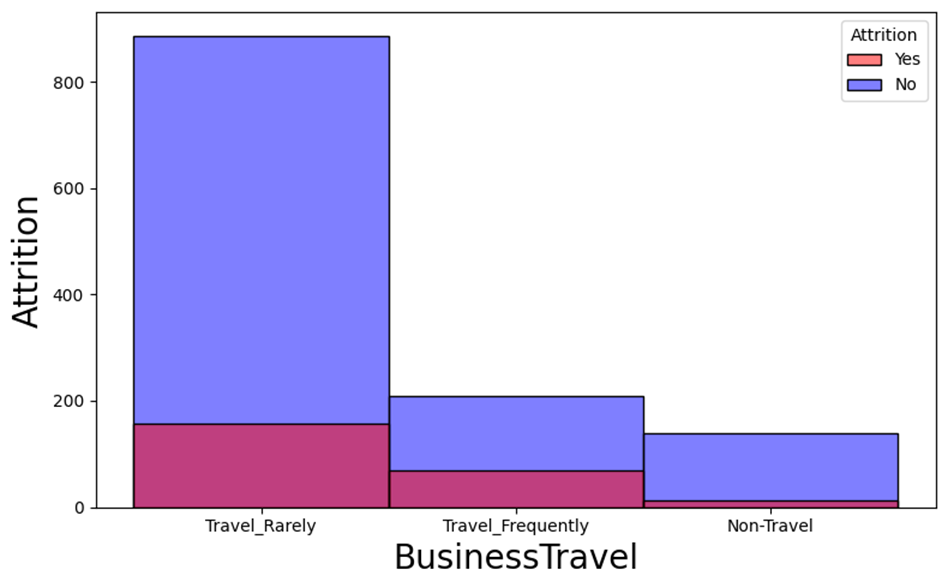
- Department: Employees from the Sales Department tend to leave more.
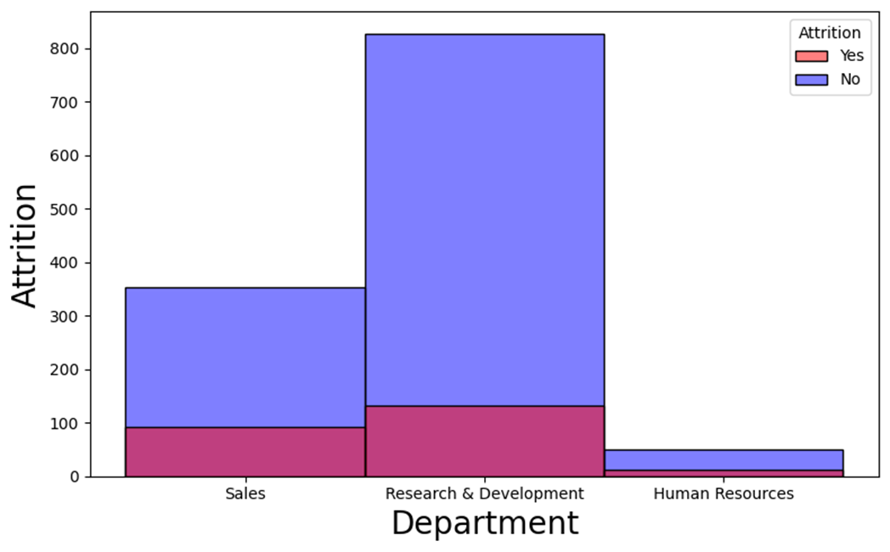
- Education Field: Those in Marketing and Technical Degree tend to leave more.
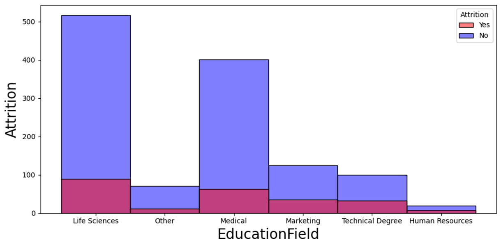
- Job Role: Sales Representatives tend to leave more.
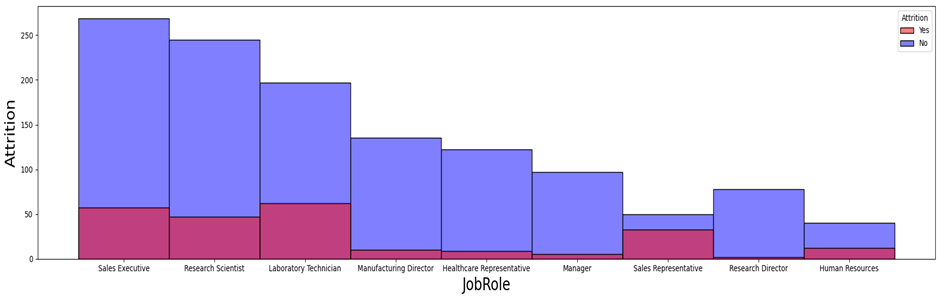
- Marital Status: Single employees tend to leave compared to married and divorced.
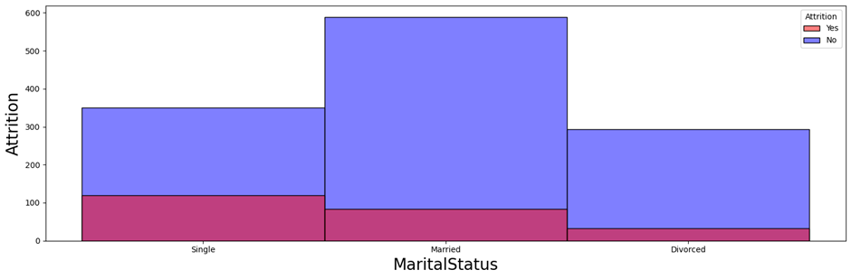
- Over Time: Those doing overtime (Yes) tend to leave more.
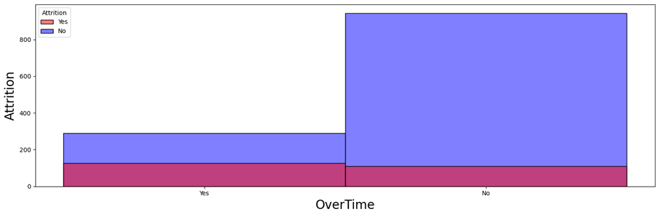
- Job Involvement: Less involved employees tend to leave the company.
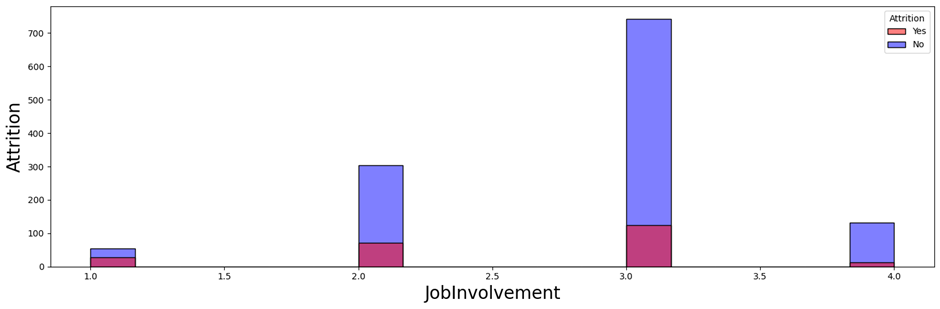
- Job Level: Less experienced (low job level) employees tend to leave the company.
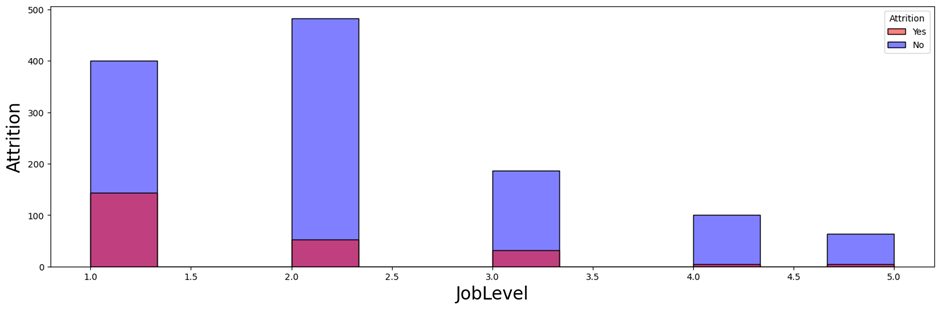

### 2.7. Other Significant Findings
- There is a significant difference in the distance from home between employees who left and stayed (p < 0.05).
- Mann-Whitney's test was used to check if there is a significant difference between the two groups.
- The p-value is 0.0023870470273627984, which is less than 0.05, so we reject the null hypothesis.
- There is a significant difference in the distance from home between employees who left and stayed.
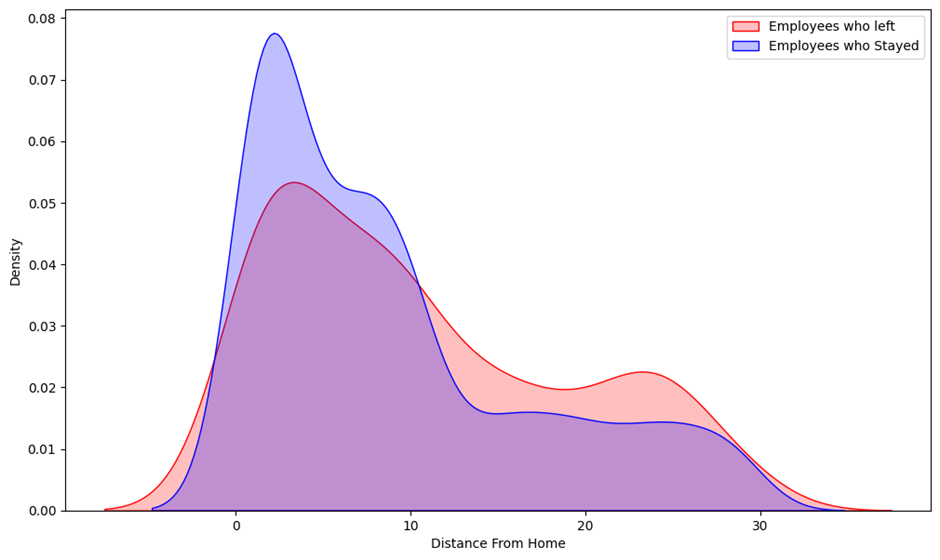
- There is a significant difference in the Years With Current Manager between employees who left and stayed (p < 0.05).
- The p-value is 1.8067542583144407e-11, which is less than 0.05, so we reject the null hypothesis.
- There is a significant difference in the years with the current manager between employees who left and stayed.
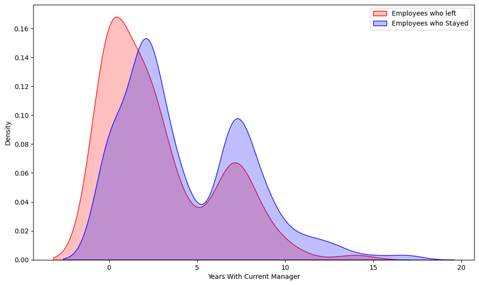
- There is a significant difference in the Total Working Years between employees who left and stayed (p < 0.05).
- The p-value is 2.399569364798952e-14, which is less than 0.05, so we reject the null hypothesis.
- There is a significant difference in the total working years between employees who left and stayed.
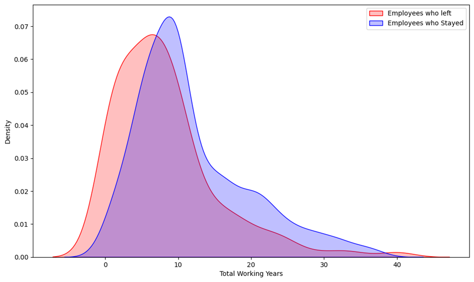
- There are no significant differences in Monthly Income between Female and Male employees (p = 0.09).
- The p-value is 0.08841668326602112, which is greater than 0.05, so we fail to reject the null hypothesis and assume no differences in Monthly Income between Male and Female employees.
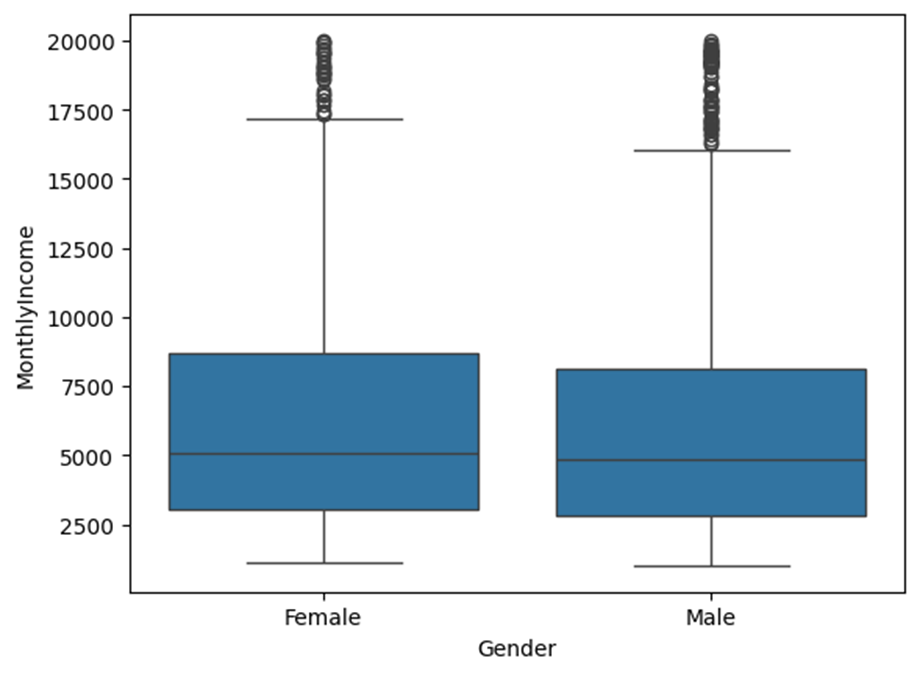
- Research Directors and Managers have the highest Monthly Income.
- Sales Representatives have the lowest Monthly Income, followed by Research Scientists and Lab Technicians.
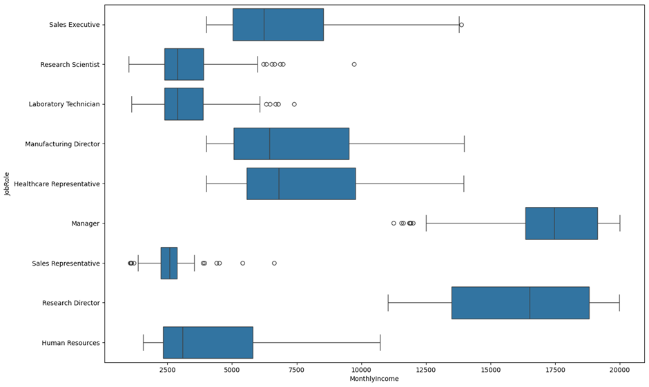

## 3. Data Preparation

### 3.1. Dropping Columns
- 'EmployeeCount', 'StandardHours', 'Over18', and 'EmployeeNumber' columns are dropped because their values are the same for all employees except 'EmployeeNumber', but it's not so relevant.

### 3.2. Drop Highly Correlated Columns
- Here, I will drop some features that are highly correlated with others: 'MonthlyIncome', 'YearsWithCurrManager', 'YearsInCurrentRole', and 'TotalWorkingYears'.

### 3.3. One-Hot Encoding
- One-hot Encoding is applied to categorical columns: 'BusinessTravel', 'Department', 'EducationField', 'Gender', 'JobRole', and 'MaritalStatus'. Then concatenated with numerical columns.

### 3.4. Data Scaling
- Min-Max Scaler is used in the scaling process.

### 3.5. Train and Test Datasets
- Data is divided into train and test using the function `train_test_split()`, with a test size of 25% for this dataset.

### 3.6. Class Balancing
- SMOTE is used in class balancing. Then, new train-test datasets are created, which are copies of the old train-test data but converted into tensors so that they can be used later for the Simple Neural Network.

## 4. Model
### 4.1 Model Selection and Training

- Models considered for selection include 'Logistic Regression', 'SVC', 'Random Forest Classifier', 'Decision Tree Classifier', 'XGB Classifier', 'CatBoost Classifier', 'K Neighbors Classifier', 'Gaussian NB', 'Gradient Boosting Classifier', 'AdaBoost Classifier', and 'Simple Neural Network Binary Classification model'.
- The 'Simple Neural Network Binary Classification model' is constructed using the PyTorch library.
- Evaluation metrics such as precision, recall, and F1-score are considered for model comparison.

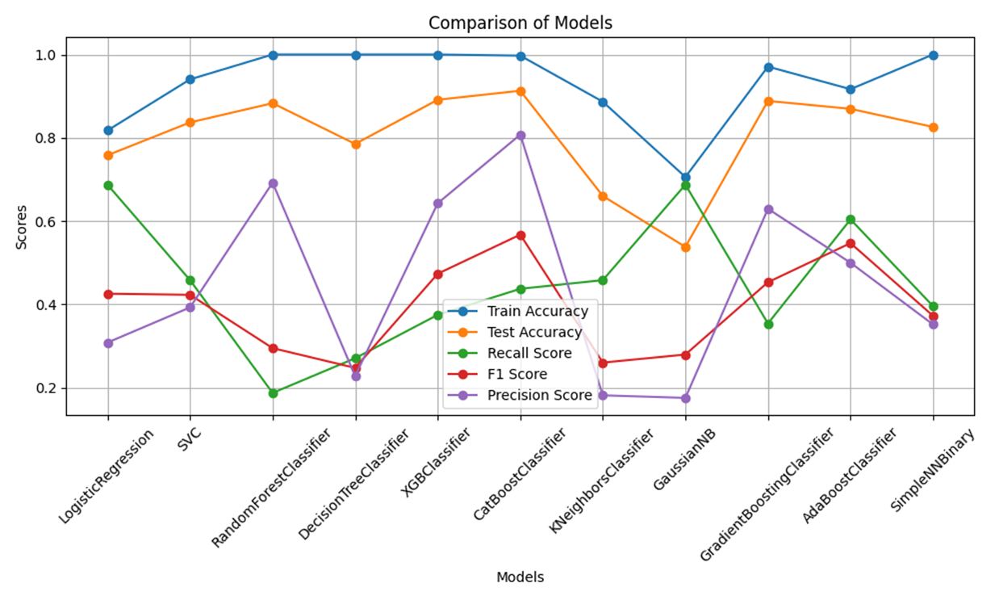

### 4.2 Hyperparameter Tuning

- Grid Search is employed to find the best parameters for Logistic Regression.
- The following parameters were found:
  - 'C': 10
  - 'class_weight': None
  - 'fit_intercept': False
  - 'multi_class': 'auto'
  - 'max_iter': 100
  - 'penalty': 'l2'
  - 'solver': 'newton-cg'
  - 'tol': 0.0001
  - 'warm_start': True

## 5. Conclusion

- Logistic Regression showed a much better recall for the minority class (0.69).
- Even with SMOTE balancing, models exhibited a low True Positive Rate for the minority class, likely due to imbalanced classes and insufficient data.
- Considering the importance of correctly predicting employee attrition and less concern about false positives, Logistic Regression is selected as the best model.

## 6. Steps to Run File

1. Set up the environment using:
 -`python -m venv file_path/env`
This will create a virtual environment.
2. Activate the environment with:
 -`file_path/env/Scripts/activate`
3. Install dependencies using:
 -`pip install -r requirements.txt`
Wait for 2 to 3 minutes until all dependencies are downloaded.
4. To visualize the data and insights, use:
 -`python data_visualisation.py`
5. To see how the model works, use:
 -`python model.py`
It will train to reload a new model with the name 'final_model.pkl' for future use in the models directory. 
6. To deactivate the virtual environment, use:
 -`deactivate`
